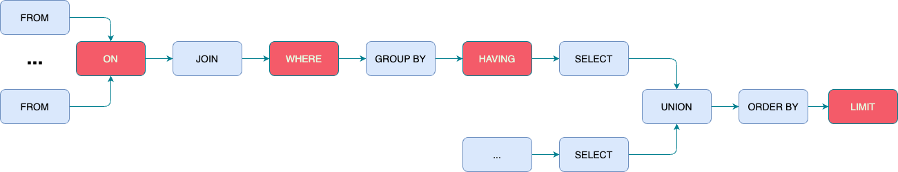

SQL（结构化查询语言）是操作关系数据库的标准语言，是一种面向集合的编程语言，它操作的对象是集合，操作的结果也是集合。

# 关系模型

关系型数据库是指采用了关系模型来组织数据的数据，而关系模型由数据结构、关系操作、完整性约束三部分组成：

* 数据结构是指关系表，包括基础表、派生表（查询结果）和虚拟表（视图）。
* 关系操作使用的就是SQL语言，常用的关系操作包括增加、删除、修改和查询（CRUD）。其中查询操作最为复杂，包括选择（Selection）、投影（Projection）、并集（Union）、交集（Intersection）、差集（Exception）以及笛卡儿积（Cartesian product）等等。
* 完整性约束用于维护数据的完整性或者满足业务约束的需求，包括实体完整性（主键约束）、参照完整性（外键约束）以及用户定义的完整性（非空约束、唯一约束、检查约束和默认值）。

# 执行顺序

* FROM：从不同数据表中获取数据；
* ON：通过FROM从**驱动表**中拿出一条符合ON条件的数据，再到**被驱动表**中根据ON条件进行扫描匹配；
* JOIN：
* WHERE：
* GROUP BY：
* HAVING：
* SELECT：
* UNION：
* ORDER BY：
* LIMIT：

逐行运算

分组聚合

select
* 运算模型
    * 逐行映射
        * select 后的表达式对每一行
    * 分组聚合
        * select后的每一个表达式对每一组只能返回一个值 （聚合值）
        * 内容为 分组key、常量或常量表达式、聚合函数
    * 二者不可混用

* 内容为表达式
    * 表字段
    * 常量或常亮表达式
    * 算术表达式
    * 布尔表达式
    * 函数
        * 分组聚合函数
        * 单行行数

过滤

where
* 执行顺序在select之前
* 表达式为布尔表达式（包含基于子查询的表达式 IN、 NOT IN、EXIST、 NOT EXIST）
* 逐行过滤（逐行运算模式,无法使用聚合函数）

having
* 执行顺序在最后
* 表达式为布尔表达式
* 分组过滤（对一组数据进行判断，可使用聚合函数）

跨行计算

窗口函数  分组  TopN

<窗口函数> over (partition by <用于分组的列名>  order by <用于排序的列名>  rows between/range between)

<窗口函数>的位置，可以放以下两种函数：
*  专用窗口函数，包括后面要讲到的
    * rank（相同值，rank相同，后续rank值 跳变（1,2,2,2,5））
    * dense_rank（相同值，rank相同，后续rank值递增（1,2,2,2,3））
    *  row_number（相同值 行数不同）等专用窗口函数
*  聚合函数，如sum. avg, count, max, min等
* lag()  lead()
    * lag(column,N,defaultValue)   在一次查询中取出同一字段的前 N 行的数据
    * lead(column,N,defaultValue)   在一次查询中取出同一字段的后N 行的数据

使用rows between可以根据自己的需求任意的控制窗口函数的范围

UNBOUNDED ：不受控的，无限的；
PRECEDING ： 在…之前；
FOLLOWING： 在…之后；

rows between …… and ……

unbounded preceding 前面所有行
unbounded following 后面所有行
current row 当前行
n following  后面n行
n preceding  前面n行

range between 按照列值限制窗口大小（在非条件表达式中等同于rows）
rows表示 行，就是前n行，后n行

而range表示的是 具体的值，比这个值小n的行，比这个值大n的行

range between是以当前值为锚点进行计算

比如

range between 4 preceding AND 7 following

表示：如果当前值为10的话就取前后的值在6到17之间的数据。

连续发生模型：

* 过滤出符合条件的记录 ，并按业务维度分区及记录序号排序打行号
* 计算 记录序号 - 行号 的值，得到的差值会有规律：  因行号是连续的，如果记录序号连续， 则差值保持恒定
* 按差值分组统计，获取 满足连续发生条件的 记录